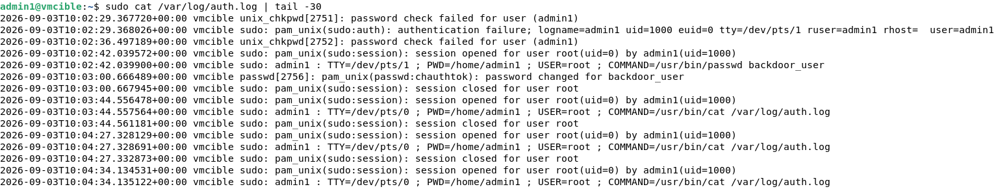
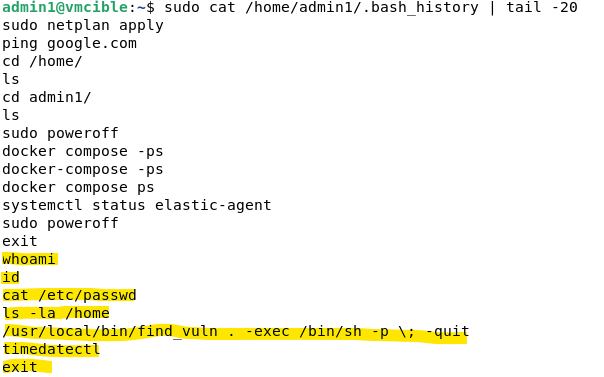
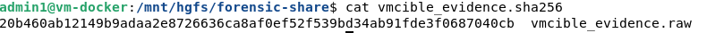
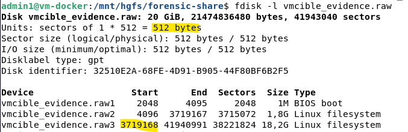
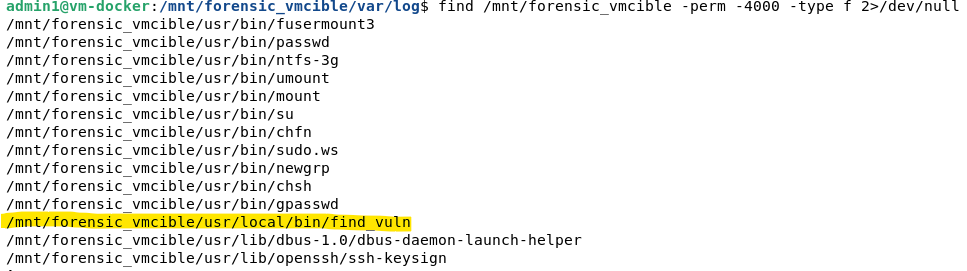
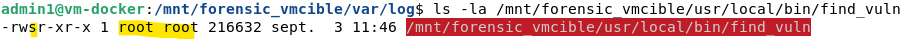
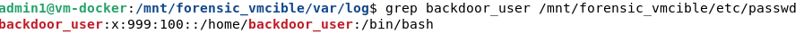
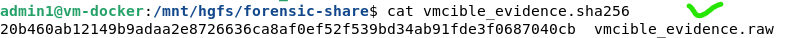

# Guide détaillé — TP2 : Investigation Numérique & Forensic (DFIR)

Guide pas à pas complet, de la préparation du scénario à l'analyse post-mortem.

---

## 0. Principe général et réutilisation du lab existant

Contrairement au TP1 où l'attaque se déroulait "en direct", le TP2 demande d'abord de **préparer une scène de compromission réaliste**, puis de jouer l'enquêteur après coup — comme si on récupérait un serveur piraté sans avoir assisté à l'attaque.

**Réutilisation de l'infrastructure du TP1** :

| VM | Rôle dans le TP1 | Rôle dans le TP2 |
|---|---|---|
| VM-CIBLE | Serveur SSH surveillé | **Le serveur qui va être "compromis"** |
| VM-KALI | Machine d'attaque (Hydra) | **Machine attaquante pour scénariser l'intrusion** |
| VM-DOCKER | Stack ELK/Shuffle | Non utilisée pour ce TP |
| VM-PFSENSE | Firewall | Non utilisée directement |

**Recommandation** : clone VM-CIBLE avant de commencer (VMware : clic droit → Manage → Clone), pour garder une version "propre" en cas de besoin de recommencer le scénario.

```bash
# Sur VM-CIBLE avant de commencer, note l'état de référence
sudo cat /etc/passwd > ~/etat_avant_compromission.txt
```

---

## 1. Étape 0 (préparatoire) — Construire le scénario de compromission

### 1.1 Créer la vulnérabilité d'accès initial

Réutilisation du compte `admin1` du TP1 avec des identifiants faibles — cohérent avec l'idée que l'attaquant a fini par obtenir un accès valide (par opposition au TP1 où l'IP avait été bloquée).

### 1.2 Créer un binaire SUID mal configuré (la faille d'élévation de privilèges)

```bash
# Exemple classique et pédagogique : le binaire "find"
sudo cp /usr/bin/find /usr/local/bin/find_vuln
sudo chmod u+s /usr/local/bin/find_vuln
sudo chown root:root /usr/local/bin/find_vuln
```

Vérifie que le bit SUID est bien actif (le `s` à la place du `x` dans les droits) :
```bash
ls -la /usr/local/bin/find_vuln
# -rwsr-xr-x 1 root root ... /usr/local/bin/find_vuln
```

**Pourquoi `find` est un bon exemple pédagogique** : `find` dispose d'une option `-exec` qui permet d'exécuter n'importe quelle commande — avec le SUID actif, cette commande s'exécute avec les droits de **root**, peu importe qui lance `find_vuln`. C'est une faille SUID documentée et classique (répertoriée sur GTFOBins).

### 1.3 Simuler l'intrusion depuis Kali

Depuis VM-KALI, connexion SSH avec le compte vulnérable :
```bash
ssh admin1@192.168.56.20
```

Une fois connecté (reconnaissance) :
```bash
whoami
id
cat /etc/passwd
ls -la /home
```

**Exploitation de la faille SUID pour élever les privilèges** :
```bash
/usr/local/bin/find_vuln . -exec /bin/sh -p \; -quit
```

Vérification de l'élévation :
```bash
whoami
# root
```

**Action malveillante de persistance** :
```bash
useradd -M -N -r -s /bin/bash backdoor_user
echo "backdoor_user:pass123" | chpasswd
```

⚠️ **Point de méthode important** : la session SSH doit être fermée **proprement** (`exit`) pour que `.bash_history` soit bien écrit sur disque — une déconnexion brutale (fermeture de fenêtre, coupure réseau) empêche l'écriture de l'historique.

### 1.4 Vérifie que les traces sont bien présentes

```bash
sudo cat /var/log/auth.log | tail -30
```



```bash
cat ~/.bash_history
```



**Observation importante** : l'historique bash du compte `admin1` ne montre pas les commandes post-exploitation (`useradd`, `chpasswd`), cohérent avec le pivot vers un shell `/bin/sh` via l'exploitation SUID (`find -exec /bin/sh -p`), qui ne journalise pas nativement l'historique comme le fait `bash`. L'impact de l'intrusion reste néanmoins objectivable par la présence du compte `backdoor_user` dans `/etc/passwd`, créé postérieurement à l'élévation de privilèges :

```bash
sudo cat /etc/passwd | grep backdoor
```

**Le scénario est prêt** : un attaquant s'est connecté via un compte faible, a exploité un SUID mal configuré pour devenir root, et a créé un compte caché.

---

## 2. Étape 1 — Sécurisation des preuves (copie bit-à-bit)

En forensic réel, on ne travaille **jamais** directement sur le disque compromis — on travaille sur une copie, pour ne jamais altérer les preuves originales.

### 2.1 Génère une image RAW du disque de VM-CIBLE

**Méthode retenue** : acquisition directement depuis l'hyperviseur (fichier `.vmdk` sur la machine hôte), plutôt qu'un `dd` exécuté depuis l'intérieur de la VM compromise — ça évite de dépendre de binaires système potentiellement altérés par l'attaquant.

Depuis la machine hôte (Windows, PowerShell), avec `qemu-img` :
```powershell
& "C:\Program Files\qemu\qemu-img.exe" convert -f vmdk -O raw VM-CIBLE-cl1.vmdk vmcible_evidence.raw
```

**Transfert vers VM-DOCKER pour l'analyse**, via un partage réseau VMware (dossier partagé monté en FUSE) :
```bash
sudo vmhgfs-fuse .host:/ /mnt/hgfs -o allow_other -o uid=$(id -u) -o gid=$(id -g)
```

### 2.2 Calcule un hash de l'image (preuve d'intégrité)

```bash
sha256sum vmcible_evidence.raw > vmcible_evidence.sha256
cat vmcible_evidence.sha256
```



### 2.3 Identifie les partitions de l'image avec `fdisk -l`

```bash
fdisk -l vmcible_evidence.raw
```



**Calcul de l'offset** (obligatoire pour monter une partition depuis une image contenant plusieurs partitions) :

- **Start** : 3719168
- **Taille de secteur** : 512 octets
- **Calcul** : 3719168 × 512 = **1904214016**

### 2.4 Monte la partition en lecture seule

#### Tentative 1 — méthode directe par offset (échec rencontré)

```bash
sudo mount -o loop,ro,offset=1904214016 vmcible_evidence.raw /mnt/forensic_vmcible
```

**Erreur retournée** : `mount: /mnt/forensic_vmcible: unknown filesystem type 'LVM2_member'`

**Explication technique** : la partition cible n'est pas un système de fichiers standard brut (ext4, XFS), mais un conteneur physique LVM (*Physical Volume*). `mount` ne peut pas interpréter directement les métadonnées LVM via un simple offset brut, car le système de fichiers réel réside à l'intérieur d'un volume logique (*Logical Volume*) encapsulé.

#### Tentative 2 — prise en charge LVM via `losetup`

```bash
sudo losetup -Pf --show vmcible_evidence.raw
# Retourne le périphérique de boucle assigné : /dev/loop12
```

#### Problème rencontré — conflit de noms LVM (VG Name Collision)

```bash
sudo pvscan
sudo vgscan
sudo vgchange -ay -K
```

**Erreur rencontrée** : le groupe de volumes de la machine d'analyse s'appelle `ubuntu-vg`, et le groupe de volumes de l'image forensic s'appelle **également** `ubuntu-vg`.

Lors de la tentative de montage (`mount -o ro /dev/ubuntu-vg/ubuntu-lv /mnt/forensic_vmcible`), le noyau renvoie `already mounted on /` — le système tentait de remonter la racine de la machine d'analyse elle-même au lieu de celle de la preuve, laissant le volume de l'image à l'état `NOT available`.

#### Résolution — renommage du VG par son UUID

```bash
# 1. Renommer le VG de l'image via son UUID (pas son nom, en conflit)
sudo vgrename ah2NgY-m5jK-JFzf-UVCi-L2oI-FxHx-o3XIqD vm_cible_vg

# 2. Activer le volume logique sous son nouveau nom
sudo vgchange -ay vm_cible_vg

# 3. Monter la preuve en lecture seule
sudo mount -o ro /dev/vm_cible_vg/ubuntu-lv /mnt/forensic_vmcible

# 4. Validation de l'accès aux données
ls -la /mnt/forensic_vmcible
```

---

## 3. Étape 2 — La traque (threat hunting dans les logs)

Toute l'exploration se fait via l'image montée en lecture seule (`/mnt/forensic_vmcible`), jamais directement sur VM-CIBLE.

### 3.1 Explore `/var/log/auth.log` (connexions)

```bash
cat /mnt/forensic_vmcible/var/log/auth.log | grep -E "Accepted|Failed|sudo"
```

⚠️ **Piège rencontré — rotation de logs** : la connexion SSH initiale n'apparaissait pas dans `auth.log`. Elle se trouvait en réalité dans le fichier archivé `auth.log.1` (logrotate). **Toujours vérifier les logs rotés**, pas seulement le fichier actif :

```bash
grep "192.168.57.50" /mnt/forensic_vmcible/var/log/auth.log.1
```

### 3.2 Explore `.bash_history` (commandes tapées)

```bash
cat /mnt/forensic_vmcible/home/admin1/.bash_history
```

Commandes de reconnaissance et la ligne d'exploitation SUID retrouvées (à condition que la session ait été fermée avec `exit`).

### 3.3 Explore `/var/log/syslog` et `auth.log` pour la création du compte

```bash
grep -E "useradd|chpasswd|CRON" /mnt/forensic_vmcible/var/log/syslog
```

**Observation** : `useradd` n'apparaît pas dans `syslog`, contrairement à l'attente initiale — sur ce système, `useradd` journalise via PAM/auth, pas syslog. La bonne source est en réalité `auth.log` (et son archive) :

```bash
grep -r "backdoor_user" /mnt/forensic_vmcible/var/log/
```

### 3.4 Point d'analyse clé — élévation silencieuse vs élévation journalisée

Une lecture attentive des logs révèle une distinction importante : **l'élévation de privilèges réelle a eu lieu via l'exploitation SUID**, immédiatement à l'exécution de `find_vuln ... -exec /bin/sh -p` — ce mécanisme n'est **jamais journalisé** comme une "session root ouverte" dans `auth.log`, contrairement à un usage de `sudo`.

Une session `sudo` légitime et distincte (utilisée par `admin1` pour finaliser le mot de passe du compte backdoor) apparaît plus tard dans les logs — elle ne doit pas être confondue avec le moment réel de la compromission, qui l'a précédée silencieusement.

➡️ Voir [`timeline.md`](./timeline.md) pour la chronologie complète et les preuves associées à chaque étape.

---

## 4. Étape 3 — Identification de la compromission (élévation de privilèges)

### 4.1 Recherche les binaires SUID sur l'image montée

```bash
find /mnt/forensic_vmcible -perm -4000 -type f 2>/dev/null
```



**Ce qui rend ce résultat suspect** : sa localisation (`/usr/local/bin`, pas un chemin système standard comme `/usr/bin`), et surtout le fait que le binaire `find` **ne devrait jamais** avoir le bit SUID actif nativement.

### 4.2 Confirme et documente la faille

```bash
ls -la /mnt/forensic_vmcible/usr/local/bin/find_vuln
```



**Explication de la faille** : le binaire `find_vuln` (copie de `/usr/bin/find`) dispose du bit SUID actif, avec `root` comme propriétaire. L'option `-exec` de `find` permet d'exécuter une commande arbitraire — combinée au SUID, cette commande hérite des droits de `root`, indépendamment de l'utilisateur qui lance le binaire. C'est une faille d'élévation de privilèges classique, référencée sur GTFOBins pour de nombreux binaires système (find, vim, less, cp...).

### 4.3 Vérifie l'impact (le compte backdoor créé)

```bash
grep backdoor_user /mnt/forensic_vmcible/etc/passwd
```



---

## 5. Démonte proprement l'image en fin d'analyse

```bash
sudo umount /mnt/forensic_vmcible
sha256sum vmcible_evidence.raw
```




### ⚠️ Leçon apprise — divergence de hash constatée

Une vérification d'intégrité a révélé une **divergence entre le hash SHA-256 initial et celui recalculé** après plusieurs sessions de montage réalisées à des jours différents.

**Cause identifiée** : `losetup -Pf --show` a été utilisé **sans le flag `-r`** (lecture seule), créant un périphérique loop en lecture-écriture par défaut. Combiné à `sudo vgchange -ay`, qui **active le groupe de volumes LVM**, cette opération écrit des métadonnées internes (numéros de séquence, timestamps LVM) sur le disque sous-jacent — **même lorsque le point de montage final du filesystem se fait en `-o ro`**.

**Ce que ça signifie méthodologiquement** : un montage `-o ro` protège uniquement la couche filesystem finale, pas les couches LVM sous-jacentes. LVM n'est pas nativement conçu pour garantir une immutabilité complète à travers toute sa pile logicielle — une limite réelle et documentée, pas une erreur de manipulation isolée.

**Correction pour une procédure plus rigoureuse** :
```bash
sudo losetup -Pfr --show vmcible_evidence.raw   # -r = read-only dès le loop device
sudo vgchange -ay --readonly vm_cible_vg          # activation en lecture seule si supporté
```

Cette observation est documentée ici de façon transparente plutôt que masquée — la vérification de hash a précisément servi à détecter cette divergence, ce qui démontre l'utilité concrète de cette étape d'intégrité.

---

## 6. Pièges fréquents à anticiper

- **Erreur d'offset au montage** : vérifie que le `Start` utilisé correspond bien à la bonne partition (souvent la 2e, la 1re étant `/boot`), et que le calcul `Start × 512` est correct.
- **`unknown filesystem type 'LVM2_member'`** : la partition est un conteneur LVM, pas un filesystem brut — passer par `losetup` + `vgscan`/`vgchange` plutôt qu'un montage direct par offset.
- **Conflit de nom de VG** entre la machine d'analyse et l'image forensic : renommer le VG de l'image via son UUID (`vgrename <UUID> nouveau_nom`), jamais son nom (ambigu en cas de doublon).
- **`.bash_history` vide ou incomplet** : la session doit être fermée avec `exit`, pas coupée brutalement.
- **Le shell obtenu via un exploit SUID (`/bin/sh`) ne journalise pas d'historique** comme `bash` — s'appuyer sur les logs système pour cette phase.
- **Timestamps incohérents entre logs** : vérifie la synchronisation NTP de la machine analysée avant la simulation.
- **Intégrité de la preuve à travers LVM** : toujours utiliser `losetup -r` et une activation LVM en lecture seule quand c'est supporté — un montage final `-o ro` ne suffit pas à garantir l'immutabilité de l'image source.

---

Une fois ce TP2 terminé, la boucle complète attendue d'un profil SOC/Blue Team est démontrée : **détecter (TP1) → répondre automatiquement (TP1) → investiguer après coup (TP2)**.
