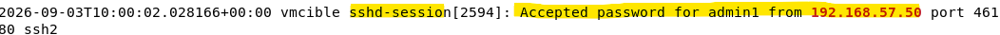
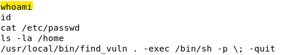
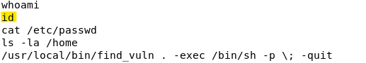
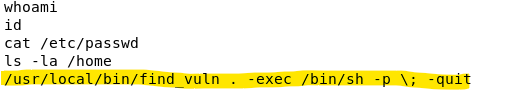
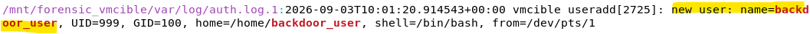
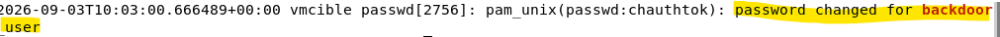
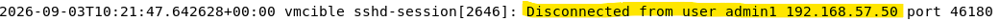

# Timeline de l'incident — TP2 Forensic

Chronologie reconstituée à partir de trois sources croisées : `auth.log` (et son archive `auth.log.1`), `.bash_history` du compte `admin1`. Tous les timestamps sont exprimés en **UTC**.

## Tableau chronologique

| Heure (UTC) | Source | Utilisateur | Événement | Type |
|---|---|---|---|---|
| 10:00:02 | auth.log.1 | admin1 | Connexion SSH réussie depuis 192.168.57.50 | Accès initial |
| *(entre 10:00:02 et 10:01:20, non horodaté)* | .bash_history | admin1 | `whoami` — reconnaissance | Reconnaissance |
| *(idem)* | .bash_history | admin1 | `id` — reconnaissance | Reconnaissance |
| *(idem)* | .bash_history | admin1 | `/usr/local/bin/find_vuln . -exec /bin/sh -p` — exploitation SUID | Exploitation |
| 10:01:20 | auth.log.1 | root (via exploit) | `useradd backdoor_user` — création du compte | Persistance |
| 10:03:00 | auth.log | root | Mot de passe défini avec succès pour `backdoor_user` | Persistance confirmée |
| 10:21:47 | auth.log.1 | admin1 | Déconnexion SSH depuis 192.168.57.50 | Fin de session |

## Note méthodologique sur l'absence de timestamps précis (`.bash_history`)

Les commandes issues de `.bash_history` ne sont pas horodatées individuellement — limitation native de Bash sans `HISTTIMEFORMAT` activé au moment du scénario. Leur position dans la timeline est déduite de leur ordre d'exécution, encadrée par la connexion SSH (10:00:02) et la première trace horodatée suivante (10:01:20, création du compte).

---

## Preuves associées (captures d'écran)

### 1. Connexion SSH réussie — 10:00:02

### 2. Reconnaissance — `whoami`

### 3. Reconnaissance — `id`

### 4. Exploitation SUID

### 5. Persistance — création du compte `backdoor_user` — 10:01:20

### 6. Persistance confirmée — mot de passe défini — 10:03:00

### 7. Fin de session — déconnexion SSH — 10:21:47

